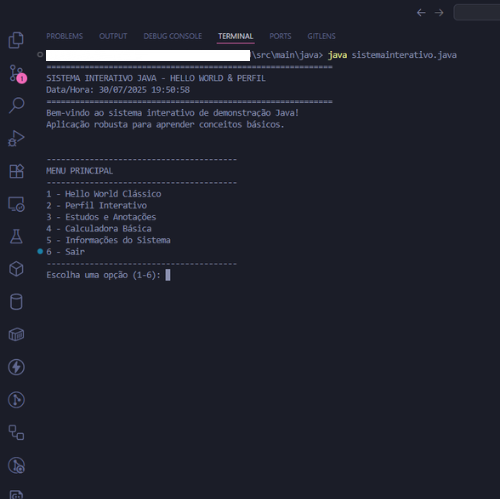

# Sistema Interativo Java

> Aplicação de console interativa para aprendizado de conceitos fundamentais de Java.


[](https://www.codefactor.io/repository/github/esousa97/primeiroprojetoj)


<div align="center">



</div>

## Sobre

Sistema de console modular que demonstra conceitos básicos de Java de forma prática:

- **Hello World Interativo** — saudações personalizadas com múltiplos estilos
- **Perfil Interativo** — coleta e exibição de dados com validação
- **Estudos e Anotações** — anotações sobre Java e dicas de estudo
- **Calculadora Básica** — operações aritméticas com tratamento de erros
- **Informações do Sistema** — dados do ambiente de execução

## Pré-requisitos

- **JDK 17+** — [Download](https://adoptium.net/)
- **Maven 3.8+** — [Download](https://maven.apache.org/download.cgi)
- **Git** — [Download](https://git-scm.com/)

## Início Rápido

```bash
# Clonar
git clone https://github.com/ESousa97/primeiroprojetoJ.git
cd primeiroprojetoJ

# Compilar e testar
mvn clean verify

# Executar
mvn exec:java -Dexec.mainClass="com.esousa.interativo.SistemaInterativo" -q
```

Ou via JAR:

```bash
mvn package -DskipTests
java -jar target/sistema-interativo-1.0.0.jar
```

## Arquitetura

```
src/main/java/com/esousa/interativo/
├── SistemaInterativo.java          ← Entry point e menu principal
├── modulo/
│   ├── HelloWorld.java             ← Saudações interativas
│   ├── PerfilInterativo.java       ← Coleta de perfil do usuário
│   ├── EstudosInterativo.java      ← Anotações e dicas de estudo
│   └── CalculadoraBasica.java      ← Operações aritméticas
└── util/
    └── ConsoleUtils.java           ← I/O centralizado (Scanner único)
```

### Decisões de Design

| Decisão | Justificativa |
|---------|---------------|
| Scanner centralizado em `ConsoleUtils` | Evita múltiplas instâncias lendo `System.in` |
| Lógica pura separada de I/O | Métodos como `calcular()` e `gerarSaudacao()` são testáveis sem mock |
| Maven como build tool | Padrão da indústria Java, reprodutível, integra com CI |
| Classes em arquivos separados | Uma classe por arquivo, conforme convenção Java |

## Scripts Disponíveis

| Comando | Descrição |
|---------|-----------|
| `mvn compile` | Compilar o projeto |
| `mvn test` | Executar testes unitários |
| `mvn verify` | Build completo + testes |
| `mvn checkstyle:check` | Verificar estilo de código |
| `mvn package` | Gerar JAR executável |

## Testes

```bash
mvn test
```

Testes unitários com JUnit 5 cobrindo:
- Operações da calculadora (soma, subtração, multiplicação, divisão, divisão por zero)
- Geração de saudações (todos os estilos)
- Mensagens por faixa etária
- Imutabilidade das listas de anotações/dicas

## Tech Stack

| Tecnologia | Versão | Propósito |
|------------|--------|-----------|
| Java | 17+ | Linguagem principal |
| Maven | 3.8+ | Build e dependências |
| JUnit 5 | 5.10.2 | Testes unitários |
| Checkstyle | 3.3.1 | Análise estática de código |
| GitHub Actions | — | CI/CD automatizado |

## Contribuindo

Veja [CONTRIBUTING.md](CONTRIBUTING.md) para guia completo.

Resumo rápido:
1. Fork o repositório
2. Crie uma branch (`git checkout -b feature/minha-feature`)
3. Commit com [Conventional Commits](https://www.conventionalcommits.org/) (`feat:`, `fix:`, `docs:`)
4. Abra um Pull Request

## Roadmap

- [ ] Persistência de anotações em arquivo
- [ ] Histórico de cálculos
- [ ] Módulo de quiz sobre Java
- [ ] Geração de relatório de perfil
- [ ] Interface gráfica (Swing/JavaFX)

## Licença

[MIT](LICENSE) © 2025 [ESousa97](https://github.com/ESousa97)

## Contato

- **Issues**: [GitHub Issues](https://github.com/ESousa97/primeiroprojetoJ/issues)
- **Autor**: [Enoque Sousa](https://www.linkedin.com/in/enoque-sousa-bb89aa168/)
