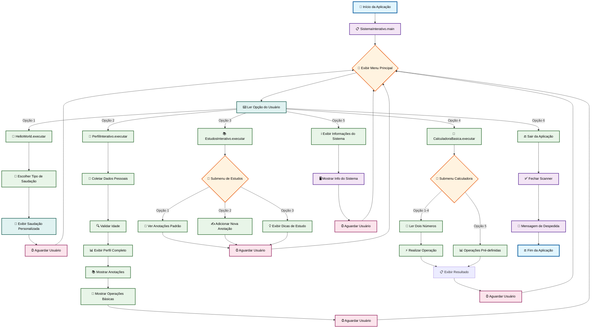

# Sistema Interativo Java: Uma Plataforma Didática para Fundamentos de Programação - Hello World

**Slogan Filosófico:** Desvendando o Java com Interatividade e Aplicações Práticas.

<div align="center">


</div>

## Abstract

Este projeto apresenta uma aplicação de console desenvolvida em Java, concebida como uma ferramenta didática para facilitar o aprendizado e a prática de conceitos fundamentais da linguagem. No contexto da educação em programação, a visualização e a experimentação interativa são cruciais para a consolidação do conhecimento. O problema abordado é a lacuna entre a teoria e a prática para iniciantes em Java, que muitas vezes enfrentam dificuldades em aplicar conceitos básicos de forma engajadora. A solução proposta é um sistema interativo modular que encapsula diversos exercícios práticos, como saudações personalizadas, gerenciamento de perfis, anotações e uma calculadora básica, todos acessíveis através de um menu intuitivo.

A metodologia empregada foca na programação orientada a objetos (POO) com uma clara separação de responsabilidades em classes dedicadas a cada funcionalidade, utilizando o `java.util.Scanner` para gerenciar a entrada de dados do usuário e implementando tratamento de exceções para robustez. Os resultados esperados e alcançados incluem a provisão de um ambiente de aprendizado prático que demonstra eficientemente operações de I/O (`System.out.println`, `Scanner`), estruturas de controle (`switch`, `while`), manipulação básica de strings e operações matemáticas. A principal contribuição deste projeto reside em sua capacidade de servir como uma plataforma unificada e interativa para que iniciantes em Java possam experimentar e solidificar seus conhecimentos em um ambiente controlado e didático, promovendo a compreensão profunda dos fundamentos da linguagem.

## Badges Abrangentes


## Sumário (Table of Contents)

*   [Abstract](#abstract)
*   [Badges Abrangentes](#badges-abrangentes)
*   [Sumário (Table of Contents)](#sumário-table-of-contents)
*   [Introdução e Motivação](#introdução-e-motivação)
*   [Arquitetura do Sistema](#arquitetura-do-sistema)
*   [Decisões de Design Chave](#decisões-de-design-chave)
*   [✨ Funcionalidades Detalhadas (com Casos de Uso)](#-funcionalidades-detalhadas-com-casos-de-uso)
*   [🛠️ Tech Stack Detalhado](#️-tech-stack-detalhado)
*   [📂 Estrutura Detalhada do Código-Fonte](#-estrutura-detalhada-do-código-fonte)
*   [📋 Pré-requisitos Avançados](#-pré-requisitos-avançados)
*   [🚀 Guia de Instalação e Configuração Avançada](#-guia-de-instalação-e-configuração-avançada)
*   [⚙️ Uso Avançado e Exemplos](#️-uso-avançado-e-exemplos)
*   [🔧 API Reference (se aplicável)](#-api-reference-se-aplicável)
*   [🧪 Estratégia de Testes e Qualidade de Código](#-estratégia-de-testes-e-qualidade-de-código)
*   [🚢 Deployment Detalhado e Escalabilidade](#-deployment-detalhado-e-escalabilidade)
*   [📜 Licença e Aspectos Legais](#-licença-e-aspectos-legais)
*   [👥 Equipe Principal e Colaboradores Chave](#-equipe-principal-e-colaboradores-chave)
*   [❓ FAQ (Perguntas Frequentes)](#-faq-perguntas-frequentes)
*   [📞 Contato e Suporte](#-contato-e-suporte)

## Introdução e Motivação

No cenário atual da educação em ciência da computação, a fase inicial de aprendizado de uma linguagem de programação, como Java, frequentemente apresenta desafios significativos. Alunos e iniciantes podem se sentir sobrecarregados pela abstração de conceitos teóricos, como variáveis, estruturas de controle e programação orientada a objetos, sem uma plataforma prática e interativa para aplicar e visualizar esses conceitos em tempo real. As soluções existentes muitas vezes se limitam a exemplos isolados ou ambientes de desenvolvimento complexos, que podem desviar o foco do aprendizado fundamental.

Este projeto nasce da motivação de preencher essa lacuna, oferecendo uma proposta de valor única: um ambiente de console unificado e interativo, projetado especificamente para consolidar o conhecimento básico em Java. Ao invés de apresentar exercícios desconectados, o "Sistema Interativo Java" integra diversas funcionalidades didáticas sob um único menu, permitindo que o usuário explore e experimente conceitos de I/O, manipulação de dados, lógica condicional e modularização de forma coesa e engajadora.

O objetivo de longo prazo é criar uma ferramenta robusta e acessível que não apenas demonstre a sintaxe da linguagem, mas também o fluxo de execução e a interação do usuário, proporcionando um feedback imediato. O impacto desejado é democratizar o acesso a um aprendizado prático e eficaz de Java, capacitando futuros desenvolvedores com uma base sólida e a confiança necessária para avançar em tópicos mais complexos.

## Arquitetura do Sistema

O "Sistema Interativo Java" adota uma arquitetura monolítica simplificada, ideal para aplicações de console didáticas, focando na clareza e na separação de responsabilidades entre módulos funcionais. O design é centrado em um componente principal de orquestração que gerencia a interação com o usuário e delega a execução de funcionalidades específicas a outras classes.

### Componentes Arquiteturais Principais

*   **`SistemaInterativo` (Orquestrador Principal):** Atua como o ponto de entrada da aplicação e o controlador central. Ele é responsável por exibir o menu principal, ler a opção do usuário, validar a entrada e despachar a chamada para a funcionalidade correspondente. Contém a lógica de ciclo de vida da aplicação (início, menu loop, encerramento).
*   **`HelloWorld` (Módulo de Saudação):** Encapsula a lógica para interagir com o usuário para obter um nome e exibir diferentes tipos de saudações (clássica, formal, descontraída).
*   **`PerfilInterativo` (Módulo de Perfil):** (Inferido) Responsável por coletar e exibir informações de perfil do usuário, como nome e talvez idade, demonstrando entrada e saída de dados mais complexas.
*   **`EstudosInterativo` (Módulo de Estudos/Anotações):** (Inferido) Provavelmente permite ao usuário inserir e visualizar anotações ou dicas de estudo, explorando manipulação de strings e talvez estruturas de dados simples.
*   **`CalculadoraBasica` (Módulo de Cálculos):** (Inferido) Implementa operações aritméticas fundamentais (adição, subtração, multiplicação, divisão), demonstrando operações numéricas e controle de fluxo.
*   **`Main.java` (Ponto de Entrada Alternativo/Simples):** Um arquivo separado para uma demonstração mínima ("Alô Mundo!"), servindo como um ponto de partida rápido para testar o ambiente.

### Interações e Fluxo de Controle

O fluxo de controle é linear e baseado em menus. O `SistemaInterativo` inicia, exibe um banner de boas-vindas e entra em um loop do menu principal. Para cada opção selecionada pelo usuário, o `SistemaInterativo` invoca um método estático `executar()` da classe do módulo correspondente. Após a conclusão da funcionalidade, o controle retorna ao `SistemaInterativo`, que aguarda a interação do usuário para retornar ao menu principal.

### Diagrama de Arquitetura



**Explicação do Diagrama:**
O diagrama ilustra o fluxo de controle centralizado no `SistemaInterativo`. A aplicação começa com o método `main` de `SistemaInterativo`, que exibe o menu e aguarda a entrada do usuário. Com base na opção escolhida, o controle é delegado a um dos módulos funcionais (Hello World, Perfil, Estudos, Calculadora) ou a uma função interna (Informações do Sistema). Após a execução da funcionalidade, o controle retorna ao menu principal, permitindo a navegação contínua até que o usuário decida sair.

### Decisões Arquiteturais Chave

1.  **Monolítico e Console-Based:** A escolha de uma aplicação monolítica de console foi feita para manter a simplicidade e focar nos fundamentos do Java, sem a complexidade adicional de frameworks web, bancos de dados ou interfaces gráficas. Isso permite que os aprendizes se concentrem na lógica de programação.
2.  **Modularização via Classes Estáticas:** Cada funcionalidade principal é encapsulada em sua própria classe (`HelloWorld`, `CalculadoraBasica`, etc.), acessada por métodos estáticos. Embora nem sempre seja a abordagem ideal para grandes sistemas orientados a objetos, para um projeto didático com foco em funções discretas, isso simplifica a invocação e evita a necessidade de gerenciar instâncias de objetos complexas.
3.  **Gerenciamento de I/O Integrado:** O `SistemaInterativo` centraliza o `Scanner` para entrada de usuário, garantindo consistência e tratamento de recursos (fechamento do scanner no `finally` block).
4.  **Tratamento de Exceções Básico:** A inclusão de blocos `try-catch` para `InputMismatchException` demonstra a importância da robustez e da validação de entrada, um conceito crucial desde o início do aprendizado.

A principal justificação para essas escolhas é a otimização para o propósito educacional do projeto, priorizando a clareza, a facilidade de compreensão e a baixa barreira de entrada para novos usuários e colaboradores. Os trade-offs incluem a falta de escalabilidade e a ausência de persistência de dados, que não são objetivos deste projeto inicial.

## Decisões de Design Chave

As decisões de design deste projeto foram tomadas com o objetivo primordial de criar uma aplicação didática, robusta e de fácil compreensão para iniciantes em Java.

*   **Linguagem de Programação: Java (JDK 11+):**
    *   **Porquê:** Java é uma das linguagens mais difundidas no mundo corporativo e acadêmico, conhecida por sua robustez, portabilidade ("write once, run anywhere") e forte tipagem. A versão 11 foi escolhida por ser uma LTS (Long Term Support), garantindo estabilidade e compatibilidade, ao mesmo tempo que oferece recursos modernos da linguagem.
    *   **Alternativas Consideradas:** Python (mais simples para iniciantes, mas menos focado em tipagem e POO estrita), C# (similar ao Java, mas com ecossistema mais focado em Microsoft). Java foi preferido pela vasta documentação, comunidade e relevância no mercado.

*   **Entrada/Saída (I/O) de Console: `java.util.Scanner` e `System.out.println`:**
    *   **Porquê:** São as classes padrão e mais diretas para interagir com o console em Java. O `Scanner` oferece métodos convenientes para ler diferentes tipos de dados (int, String, etc.), e `System.out.println` é o método canônico para exibir informações.
    *   **Alternativas Consideradas:** `BufferedReader` (mais complexo para iniciantes, focado em performance para grandes volumes). A simplicidade do `Scanner` é ideal para este projeto didático.

*   **Modularidade e Organização do Código:**
    *   **Porquê:** A aplicação é dividida em classes distintas (`HelloWorld`, `PerfilInterativo`, etc.) para cada funcionalidade. Isso promove o princípio da responsabilidade única (SRP) e demonstra a modularização em Java, mesmo em um contexto de aplicação de console. O uso de métodos estáticos para as funcionalidades simplifica a invocação a partir do menu principal, eliminando a necessidade de gerenciar instâncias de objetos para operações simples.
    *   **Alternativas Consideradas:** Uma única classe `Main` com todas as funcionalidades (levaria a um código monolítico e difícil de manter), ou a criação de interfaces e classes abstratas (complexidade desnecessária para o escopo didático inicial).

*   **Tratamento de Exceções: `try-catch` para `InputMismatchException`:**
    *   **Porquê:** Essencial para tornar a aplicação robusta e amigável ao usuário. A validação de entrada impede que o programa falhe inesperadamente quando o usuário digita um tipo de dado incorreto (ex: texto onde se espera um número). Isso ensina a importância de lidar com entradas inválidas.
    *   **Alternativas Consideradas:** Ignorar o tratamento (resultaria em travamentos), ou usar frameworks de validação (excesso de complexidade).

*   **Manipulação de Data e Hora: `java.time.LocalDateTime` e `DateTimeFormatter`:**
    *   **Porquê:** As classes do pacote `java.time` (introduzidas no Java 8) são a API moderna e recomendada para manipulação de data e hora, oferecendo uma abordagem mais robusta e menos propensa a erros do que as antigas classes `java.util.Date` e `java.util.Calendar`.
    *   **Alternativas Consideradas:** `java.util.Date` (legado, com problemas de mutabilidade e thread-safety).

*   **Ausência de Dependências Externas/Frameworks:**
    *   **Porquê:** O projeto é intencionalmente "pure Java", utilizando apenas a API padrão (JDK). Isso garante que o foco permaneça nos conceitos da linguagem em si, sem a curva de aprendizado adicional de frameworks ou bibliotecas de terceiros. Reduz a complexidade de setup e a sobrecarga de dependências.
    *   **Alternativas Consideradas:** Uso de Apache Commons Lang, Guava para utilitários (desnecessário para o escopo).

Essas decisões de design visam criar um ambiente de aprendizado eficaz, que não apenas funcione, mas que também seja um bom exemplo de práticas de programação fundamentais em Java.

## ✨ Funcionalidades Detalhadas (com Casos de Uso)

O Sistema Interativo Java é composto por um conjunto de funcionalidades modulares, cada uma projetada para demonstrar conceitos específicos da programação Java de forma prática e interativa.

### 1. Menu Principal Interativo

*   **Propósito:** Serve como o hub central da aplicação, permitindo ao usuário navegar entre as diferentes funcionalidades disponíveis. Garante uma experiência de usuário fluida e intuitiva em um ambiente de console.
*   **Casos de Uso:**
    *   **Navegação:** O usuário visualiza as opções (1 a 6) e digita o número correspondente para acessar uma funcionalidade.
    *   **Validação de Entrada:** Se o usuário digitar um valor não numérico ou uma opção fora do intervalo permitido, o sistema exibe uma mensagem de erro e solicita uma nova entrada, demonstrando o tratamento de `InputMismatchException`.
    *   **Retorno ao Menu:** Após a conclusão de qualquer funcionalidade (exceto "Sair"), o sistema aguarda a interação do usuário (pressionar Enter) para retornar ao menu principal, mantendo a continuidade.

### 2. Hello World Clássico

*   **Propósito:** Uma versão interativa do programa "Hello World", que permite ao usuário personalizar a saudação e explorar diferentes estilos de comunicação. Demonstra entrada de dados (`Scanner`), saída de dados (`System.out.println`) e lógica condicional (`if-else`, `switch`).
*   **Casos de Uso:**
    *   **Saudação Personalizada:** O usuário é solicitado a digitar seu nome. Se um nome for fornecido, a saudação o incluirá (ex: "Olá, [Nome]!"). Se o campo for deixado em branco, o sistema usa "Mundo" por padrão.
    *   **Estilos de Saudação:** O usuário pode escolher entre:
        *   `1 - Clássica`: "Olá, [Nome]!"
        *   `2 - Formal`: "Seja bem-vindo(a), [Nome]. É um prazer tê-lo(a) aqui!"
        *   `3 - Descontraída`: "E aí, [Nome]! Tudo bem?"
        *   `4 - Todas`: Exibe todas as saudações sequencialmente.
    *   **Validação de Opção:** A entrada para o estilo de saudação é validada para garantir que seja um número entre 1 e 4.

### 3. Perfil Interativo

*   **Propósito:** (Inferido do nome e estrutura) Permite ao usuário inserir informações básicas sobre si mesmo, como nome e idade, e o sistema as exibe de volta. Essencial para praticar a leitura de diferentes tipos de dados e a formatação de saída.
*   **Casos de Uso:**
    *   **Coleta de Dados:** O sistema solicita o nome e a idade do usuário.
    *   **Exibição de Perfil:** Após a coleta, o sistema exibe um resumo do perfil, como "Nome: [Nome], Idade: [Idade] anos.".
    *   **Validação de Idade:** A entrada da idade pode incluir validação para garantir que seja um número inteiro positivo.

### 4. Estudos e Anotações

*   **Propósito:** (Inferido do nome e estrutura) Oferece uma funcionalidade para registrar pequenas anotações ou exibir dicas de estudo pré-definidas. Pode demonstrar manipulação de strings, talvez armazenamento temporário em coleções simples.
*   **Casos de Uso:**
    *   **Registro de Anotação:** O usuário pode digitar uma anotação ou um pensamento. O sistema então exibe a anotação para confirmação.
    *   **Dicas de Estudo:** O sistema pode apresentar uma lista de dicas de estudo fixas ou aleatórias relacionadas à programação Java.

### 5. Calculadora Básica

*   **Propósito:** (Inferido do nome e estrutura) Uma calculadora simples que executa operações aritméticas básicas (adição, subtração, multiplicação, divisão) entre dois números. É ideal para demonstrar operadores aritméticos, controle de fluxo (`if-else` ou `switch` para operações) e tratamento de casos especiais (ex: divisão por zero).
*   **Casos de Uso:**
    *   **Seleção de Operação:** O usuário escolhe a operação desejada (ex: 1 para Soma, 2 para Subtração).
    *   **Entrada de Números:** O usuário insere dois números para a operação.
    *   **Cálculo e Resultado:** O sistema realiza o cálculo e exibe o resultado.
    *   **Tratamento de Divisão por Zero:** Para a operação de divisão, o sistema deve verificar se o segundo número é zero e, em caso afirmativo, exibir uma mensagem de erro apropriada.

### 6. Informações do Sistema

*   **Propósito:** Exibe detalhes sobre o ambiente de execução Java e o sistema operacional. Demonstra o uso de `System.getProperty()` para acessar propriedades do sistema e `java.time` para exibir a data e hora atuais.
*   **Casos de Uso:**
    *   **Visualização de Ambiente:** O usuário pode rapidamente ver a versão do JDK, o diretório de instalação do Java, o nome do sistema operacional, o nome do usuário e o diretório de trabalho atual.
    *   **Data/Hora Atual:** Exibe a data e hora exatas da consulta, formatadas.

### 7. Sair

*   **Propósito:** Encerra a execução da aplicação de forma controlada e limpa, liberando recursos (como o `Scanner`).
*   **Casos de Uso:**
    *   **Finalização da Aplicação:** O usuário seleciona a opção "Sair" e o programa exibe uma mensagem de despedida antes de encerrar.

## 🛠️ Tech Stack Detalhado

Este projeto foi desenvolvido com um foco na simplicidade e no uso de tecnologias fundamentais, priorizando o aprendizado dos conceitos básicos de Java sem a introdução de complexidades adicionais de frameworks externos.

| Categoria                | Tecnologia        | Versão Específica (se aplicável) | Propósito no Projeto                                                                                             | Justificativa da Escolha                                                                                                                                      |
| :----------------------- | :---------------- | :------------------------------- | :--------------------------------------------------------------------------------------------------------------- | :------------------------------------------------------------------------------------------------------------------------------------------------------------ |
| **Linguagem de Programação** | Java              | JDK 11 ou superior               | Linguagem principal para toda a lógica da aplicação, estrutura de dados e controle de fluxo.                     | Escolha padrão para ensino de POO e amplamente utilizada na indústria, garantindo relevância e robustez. JDK 11 é uma versão LTS estável.                   |
| **Ferramentas de Build/IDE** | IntelliJ IDEA     | Última versão recomendada        | Ambiente de Desenvolvimento Integrado (IDE) para codificação, compilação, depuração e execução do projeto.       | Oferece excelente suporte a Java, refatoração inteligente, depuração robusta e facilidade de uso para desenvolvedores de todos os níveis.                   |
|                          | Apache NetBeans   | Última versão recomendada        | IDE alternativa para desenvolvimento Java.                                                                       | Opção popular e gratuita, com bom suporte a projetos Java, ideal para ambientes acadêmicos e iniciantes.                                                     |
|                          | Eclipse           | Última versão recomendada        | Outra IDE amplamente utilizada na comunidade Java.                                                               | Flexível e extensível, com vasto ecossistema de plugins, adequada para diferentes fluxos de trabalho.                                                        |
| **Bibliotecas Padrão (JDK)** | `java.util.Scanner` | N/A                              | Leitura de entrada de dados do usuário via console (números, strings).                                         | API padrão e intuitiva para I/O básico em console, essencial para aplicações interativas.                                                                    |
|                          | `System.out`      | N/A                              | Saída de dados para o console (exibição de mensagens, resultados).                                               | Método fundamental e universal para saída de dados em Java, parte integrante do aprendizado inicial.                                                         |
|                          | `java.time.*`     | N/A                              | Manipulação e formatação de data e hora (ex: para exibir informações do sistema).                                | API moderna e robusta para data e hora (introduzida no Java 8), superando as deficiências das APIs legadas.                                                   |
|                          | `java.lang.*`     | N/A                              | Classes fundamentais (ex: `String`, `Integer`, `Exception`) para manipulação de dados e tratamento de erros.     | Pacote importado automaticamente, base para toda a programação Java, fornecendo tipos de dados primitivos e classes essenciais.                               |

## 📂 Estrutura Detalhada do Código-Fonte

A organização do código-fonte deste projeto segue uma estrutura padrão para aplicações Java baseadas em Maven/Gradle (mesmo que não explicitamente configurado com um sistema de build, a estrutura de pastas é familiar), promovendo a clareza e a modularidade. A filosofia é separar o código-fonte principal dos arquivos de configuração e de ferramentas, e dentro do `src`, organizar as classes por pacotes lógicos.

```
primeiroprojetoJ-master/
├── .gitignore              # Define arquivos e diretórios a serem ignorados pelo Git (ex: arquivos de build, de IDE, temporários).
├── assets
│     └── Desafios.png
├── README.md               # Este arquivo de documentação do projeto.
├── primeiroprojetoJ.iml    # Arquivo de configuração de módulo do IntelliJ IDEA.
├── src/                    # Contém todo o código fonte da aplicação Java.
│   ├── Main.java           # Um ponto de entrada simples para um "Alô Mundo!" rápido.
│   └── main/               # Raiz do código fonte principal da aplicação.
│       └── java/           # Contém os pacotes Java da aplicação.
│           └── main/java/  # Pacote principal da aplicação (nome do pacote é 'main.java').
│               ├── CalculadoraBasica.class   # Classe compilada para operações matemáticas básicas.
│               ├── EstudosInterativo.class   # Classe compilada para funcionalidades de estudo/anotações.
│               ├── HelloWorld.class          # Classe compilada para a funcionalidade "Hello World".
│               ├── PerfilInterativo.class    # Classe compilada para a funcionalidade de perfil do usuário.
│               ├── SistemaInterativo.class   # Classe compilada do orquestrador principal.
│               └── SistemaInterativo.java    # Código fonte da classe principal que gerencia o menu e invoca as funcionalidades.
```

### Explicação dos Componentes Principais:

*   **`primeiroprojetoJ-master/`**: O diretório raiz do projeto. O nome `primeiroprojetoJ-master` sugere que este foi o nome do diretório ao ser extraído de um arquivo `.zip` ou clonado de um repositório, onde `primeiroprojetoJ` seria o nome original do projeto ou módulo.
*   **`.gitignore`**: Este arquivo é crucial para o controle de versão. Ele lista padrões de nomes de arquivos e diretórios que o Git deve ignorar, como arquivos de build (`out/`, `bin/`), configurações específicas de IDEs (`.iml`, `.project`, `.settings`, `.vscode/`), e arquivos temporários de sistema (`.DS_Store`). Isso garante que apenas o código-fonte relevante seja versionado.
*   **`README.md`**: O arquivo de documentação principal do projeto que você está lendo. Ele fornece uma visão geral, instruções e detalhes técnicos.
*   **`primeiroprojetoJ.iml`**: Este é um arquivo de configuração gerado pelo IntelliJ IDEA. Ele define as configurações específicas do módulo do projeto, como as dependências do SDK (JDK), os diretórios de origem e de saída, e outras configurações de projeto que a IDE utiliza para compilar e executar o código.
*   **`src/`**: Este diretório é a convenção padrão em projetos Java para armazenar o código fonte.
    *   **`Main.java`**: Embora o projeto principal seja `SistemaInterativo.java`, `Main.java` serve como um ponto de entrada alternativo e simplificado, contendo apenas um "Alô Mundo!". Isso é útil para testes rápidos ou para demonstrar a configuração básica de um projeto Java.
    *   **`src/main/java/`**: Esta subestrutura é uma convenção comum em projetos Java, especialmente aqueles que usam sistemas de build como Maven ou Gradle. Ela indica que o código dentro deste diretório pertence ao "código fonte principal" (main) e é escrito em "Java".
    *   **`main/java/SistemaInterativo.java`**: Este é o coração da aplicação. Ele contém o método `main` que inicia o programa, gerencia o menu principal, lê a entrada do usuário e delega a execução para as outras classes de funcionalidade (como `HelloWorld`, `PerfilInterativo`, etc.). O arquivo fornecido também contém a implementação da classe `HelloWorld` como uma classe aninhada (ou interna), o que é válido em Java para classes auxiliares menores.
    *   **`main/java/*.class`**: Estes são os arquivos de bytecode Java gerados pelo compilador a partir dos arquivos `.java` correspondentes. Eles representam as versões compiladas das classes `CalculadoraBasica`, `EstudosInterativo`, `HelloWorld`, `PerfilInterativo`, e `SistemaInterativo`, que são executáveis pela Java Virtual Machine (JVM). A presença apenas dos arquivos `.class` para `CalculadoraBasica`, `EstudosInterativo`, e `PerfilInterativo` sugere que seus arquivos `.java` correspondentes existem (ou existiram) e foram compilados, mesmo que não tenham sido fornecidos no trecho.

Essa estrutura facilita a organização do código, a colaboração entre desenvolvedores e a integração com ferramentas de build e IDEs.

## 📋 Pré-requisitos Avançados

Para clonar, compilar e executar o Sistema Interativo Java, você precisará dos seguintes pré-requisitos instalados e configurados em seu ambiente de desenvolvimento:

*   **Java Development Kit (JDK):**
    *   **Versão Mínima:** JDK 11.
    *   **Versões Recomendadas/Testadas:** JDK 11 ou superior (ex: JDK 17, JDK 21).
    *   **Propósito:** O JDK é essencial, pois inclui o Java Runtime Environment (JRE) para executar aplicações Java, o compilador Java (`javac`) para transformar o código-fonte em bytecode, e outras ferramentas de desenvolvimento.
    *   **Verificação:** Para verificar sua versão do JDK, abra um terminal ou prompt de comando e execute:
        ```bash
        java -version
        javac -version
        ```
        Certifique-se de que a saída indique uma versão 11 ou superior.

*   **Git:**
    *   **Versão Mínima:** 2.x
    *   **Propósito:** Ferramenta de controle de versão distribuído, necessária para clonar o repositório do projeto.
    *   **Instalação:** Baixe em [git-scm.com](https://git-scm.com/).
    *   **Verificação:**
        ```bash
        git --version
        ```

*   **Ambiente de Desenvolvimento Integrado (IDE) para Java (Opcional, mas Altamente Recomendado):**
    *   **IntelliJ IDEA (Edição Community ou Ultimate):**
        *   **Recomendado:** É a IDE utilizada para o desenvolvimento original deste projeto e oferece o melhor suporte.
        *   **Download:** [JetBrains IntelliJ IDEA](https://www.jetbrains.com/idea/download/)
    *   **Eclipse IDE for Java Developers:**
        *   **Alternativa:** Uma IDE popular e de código aberto.
        *   **Download:** [Eclipse IDE](https://www.eclipse.org/downloads/packages/)
    *   **Apache NetBeans:**
        *   **Alternativa:** Outra IDE de código aberto com bom suporte a Java.
        *   **Download:** [NetBeans Apache](https://netbeans.apache.org/download/index.html)
    *   **Propósito:** Uma IDE facilita significativamente o desenvolvimento Java, oferecendo recursos como autocompletar código, depuração, gerenciamento de projetos e execução simplificada.

**Configuração de Variáveis de Ambiente:**
É crucial que a variável de ambiente `JAVA_HOME` esteja configurada para apontar para o diretório de instalação do seu JDK, e que o diretório `bin` do JDK (`%JAVA_HOME%\bin` no Windows ou `$JAVA_HOME/bin` no Linux/macOS) esteja incluído na variável `PATH` do seu sistema. Isso permite que você execute comandos Java (`java`, `javac`) a partir de qualquer diretório no terminal.

## 🚀 Guia de Instalação e Configuração Avançada

Este guia detalha os passos necessários para configurar e executar o Sistema Interativo Java em seu ambiente de desenvolvimento.

### 1. Clonar o Repositório

Primeiro, você precisa obter uma cópia local do código-fonte do projeto. Abra seu terminal ou prompt de comando e execute o seguinte comando:

```bash
git clone https://github.com/ESousa97/DesafioJava1.git
```

### 2. Navegar até o Diretório do Projeto

Após a clonagem, navegue até o diretório específico do projeto que contém os arquivos `.java` e `.iml`:

```bash
cd primeiroprojetoJ-master/
```

### 3. Abrir o Projeto na IDE (Recomendado)

A maneira mais fácil de trabalhar com este projeto é abri-lo em uma IDE Java compatível, como IntelliJ IDEA (recomendado), Eclipse ou NetBeans.

#### Para IntelliJ IDEA:

1.  Abra o IntelliJ IDEA.
2.  Na tela de boas-vindas, selecione "Open" ou vá em `File > Open...`.
3.  Navegue até o diretório `primeiroprojetoJ-master` (que você clonou) e selecione-o. Clique em "Open".
4.  O IntelliJ IDEA deve reconhecer o arquivo `primeiroprojetoJ.iml` e configurar o projeto automaticamente.
5.  Certifique-se de que o JDK 11 (ou superior) esteja configurado para o projeto. Você pode verificar isso em `File > Project Structure... > Project SDK`. Se não estiver configurado, adicione seu JDK.

#### Para Eclipse ou NetBeans:

1.  **Eclipse:** Vá em `File > Import... > Git > Projects from Git > Clone URI`. Cole a URL do repositório (`https://github.com/ESousa97/DesafioJava1.git`). Siga os passos e importe como um "General Project" ou "Existing Projects into Workspace" e então configure-o como um projeto Java.
2.  **NetBeans:** Vá em `File > Open Project...` e selecione o diretório `primeiroprojetoJ-master`. O NetBeans tentará abrir o projeto.

### 4. Compilar e Executar o Projeto

Este projeto não requer dependências externas além do JDK. A compilação e execução podem ser feitas diretamente pela IDE ou via linha de comando.

#### Execução via IDE (Recomendado):

1.  **Localize a Classe Principal:** No painel de projeto da sua IDE, navegue até `src/main/java/main/java/SistemaInterativo.java`.
2.  **Executar:**
    *   **IntelliJ IDEA:** Clique com o botão direito no arquivo `SistemaInterativo.java` e selecione `Run 'SistemaInterativo.main()'`. Alternativamente, você pode clicar no ícone de "play" (verde) ao lado do método `main` dentro do arquivo.
    *   **Eclipse/NetBeans:** Clique com o botão direito no arquivo `SistemaInterativo.java` e selecione `Run As > Java Application`.

A aplicação será iniciada no console da sua IDE, exibindo o menu principal.

#### Execução via Linha de Comando (Alternativo):

Se você preferir executar sem uma IDE, siga estes passos:

1.  **Navegue até o diretório do projeto:**
    ```bash
    cd DesafioJava1/primeiroprojetoJ-master/
    ```
2.  **Compile os arquivos `.java`:**
    Você precisa compilar todos os arquivos `.java` para gerar os `.class`. O compilador precisa saber onde encontrar as classes. Assumindo que `CalculadoraBasica.java`, `EstudosInterativo.java`, `HelloWorld.java`, `PerfilInterativo.java` existem no mesmo pacote que `SistemaInterativo.java`, você pode compilar a partir do diretório `src`.
    ```bash
    # Primeiro, navegue para o diretório 'src'
    cd src
    # Compile o arquivo Main.java (se quiser executá-lo)
    javac Main.java
    # Compile os arquivos do pacote principal.
    # Você pode precisar especificar o diretório de destino para os .class files.
    # Exemplo: compilar o pacote main.java
    javac -d . main/java/main/java/*.java
    # Se SistemaInterativo.java contiver as outras classes como internas, apenas compile ele:
    # javac -d . main/java/main/java/SistemaInterativo.java
    ```
    Isso criará a estrutura de diretórios `main/java/main/java/` com os arquivos `.class` dentro do diretório `src`.

3.  **Execute a aplicação principal (`SistemaInterativo`):**
    Após a compilação, navegue de volta para o diretório `src` (se você saiu) e execute a classe principal especificando o pacote completo:

    ```bash
    # A partir do diretório 'src'
    java main.java.main.java.SistemaInterativo
    ```
    Ou, para o `Main.java` simples:
    ```bash
    # A partir do diretório 'src'
    java Main
    ```

    A aplicação será iniciada no seu terminal, exibindo o menu interativo.

**Configuração de Variáveis de Ambiente:**
Não são necessárias variáveis de ambiente específicas para o projeto além da configuração padrão do JDK (`JAVA_HOME` e `PATH`) já mencionada nos pré-requisitos.

## ⚙️ Uso Avançado e Exemplos

O Sistema Interativo Java é projetado para ser intuitivo, mas aqui estão exemplos de como interagir com suas funcionalidades para explorar todo o seu potencial didático.

### Navegando pelo Menu Principal

Após iniciar a aplicação (seja pela IDE ou linha de comando), você será saudado com o menu principal:

```
============================================================
SISTEMA INTERATIVO JAVA - HELLO WORLD & PERFIL
Data/Hora: DD/MM/AAAA HH:MM:SS
============================================================
Bem-vindo ao sistema interativo de demonstração Java!
Aplicação robusta para aprender conceitos básicos.

----------------------------------------
MENU PRINCIPAL
----------------------------------------
1 - Hello World Clássico
2 - Perfil Interativo
3 - Estudos e Anotações
4 - Calculadora Básica
5 - Informações do Sistema
6 - Sair
----------------------------------------
Escolha uma opção (1-6):
```

Para interagir, basta digitar o número correspondente à opção desejada e pressionar `Enter`.

### Exemplo de Uso: Hello World Clássico

Vamos demonstrar a funcionalidade "Hello World Clássico" (Opção 1):

1.  No menu principal, digite `1` e pressione `Enter`.
2.  Você verá:
    ```
    ----------------------------------------
    HELLO WORLD INTERATIVO
    ----------------------------------------
    Digite seu nome (ou pressione Enter para usar 'Mundo'): _
    ```
3.  Digite `João Silva` e pressione `Enter`.
4.  Em seguida, você será solicitado a escolher o tipo de saudação:
    ```
    Escolha o tipo de saudação:
    1 - Clássica
    2 - Formal
    3 - Descontraída
    4 - Todas
    Opção (1-4): _
    ```
5.  Digite `2` (para saudação Formal) e pressione `Enter`.
6.  O sistema exibirá o resultado:
    ```
    Resultado:
    Seja bem-vindo(a), João Silva. É um prazer tê-lo(a) aqui!
    ```
7.  Pressione `Enter` para retornar ao menu principal.

### Exemplo de Uso: Calculadora Básica (Inferido)

Para a funcionalidade "Calculadora Básica" (Opção 4), o fluxo seria similar:

1.  No menu principal, digite `4` e pressione `Enter`.
2.  A calculadora apresentará as operações disponíveis (ex: Soma, Subtração, Multiplicação, Divisão).
3.  Você escolheria uma operação (ex: `1` para Soma).
4.  O sistema solicitaria o primeiro número (ex: `10`) e o segundo número (ex: `5`).
5.  O resultado seria exibido (ex: `Resultado: 15`).
6.  Para a divisão, o sistema demonstraria o tratamento de divisão por zero:
    *   Escolha Divisão.
    *   Primeiro número: `10`
    *   Segundo número: `0`
    *   Resultado: `Erro: Divisão por zero não permitida!`

### Exemplo de Uso: Informações do Sistema

Para visualizar as informações do seu ambiente Java (Opção 5):

1.  No menu principal, digite `5` e pressione `Enter`.
2.  O sistema exibirá detalhes como:
    ```
    ----------------------------------------
    INFORMAÇÕES DO SISTEMA
    ----------------------------------------
    Versão Java: 11.0.12
    Java Home: /caminho/para/seu/jdk
    Sistema Operacional: Windows 10
    Usuário: seu_usuario
    Diretório Atual: /caminho/do/projeto/primeiroprojetoJ-master
    Data/Hora Atual: DD/MM/AAAA HH:MM:SS
    ```
3.  Pressione `Enter` para retornar ao menu principal.

Esses exemplos ilustram a natureza interativa do projeto e como cada funcionalidade pode ser explorada para entender os conceitos de programação Java em ação.

## 🔧 API Reference (se aplicável)

Este projeto é uma aplicação de console interativa e **não expõe uma API RESTful ou qualquer outra interface programática externa**. Todas as interações ocorrem diretamente via entrada e saída padrão (terminal/console).

Portanto, esta seção **não é aplicável** ao escopo atual do Sistema Interativo Java.

Em um projeto futuro, se houver uma evolução para incluir comunicação entre processos, serviços web ou integração com outras aplicações, uma seção de referência de API seria desenvolvida para detalhar endpoints, métodos, parâmetros, e formatos de requisição/resposta.

## 🧪 Estratégia de Testes e Qualidade de Código

Dado o escopo didático e a natureza de aplicação de console deste projeto, a estratégia de testes primária é a **validação manual interativa**. No entanto, para projetos mais complexos e em um ambiente de desenvolvimento profissional, a automação de testes e a garantia de qualidade de código são cruciais.

### Estratégia de Testes Atual

*   **Testes Manuais/Interativos:**
    *   **Descrição:** Os testes são realizados diretamente pelo usuário/desenvolvedor, interagindo com o menu e as funcionalidades da aplicação no console. Cada opção é selecionada, e as entradas são fornecidas para verificar se o comportamento da aplicação corresponde às expectativas.
    *   **Cobertura:** Validação de entradas (ex: números em vez de texto, opções dentro do intervalo), verificação da lógica de cada funcionalidade (saudações corretas, cálculos precisos), e testes de fluxo de navegação no menu.
    *   **Ferramentas:** Nenhuma ferramenta de teste automatizado é utilizada explicitamente neste estágio.

### Qualidade de Código

A qualidade do código é mantida através de:

*   **Clareza e Legibilidade:** Código escrito de forma clara, com nomes de variáveis e métodos descritivos, e comentários onde a lógica pode ser menos óbvia.
*   **Modularização:** Separação de funcionalidades em classes distintas para promover a organização e a responsabilidade única.
*   **Tratamento de Exceções:** Implementação básica de `try-catch` para lidar com entradas inválidas, aumentando a robustez da aplicação.
*   **Conformidade com Convenções Java:** Seguir as convenções de código padrão do Java (ex: camelCase para variáveis/métodos, PascalCase para classes).

### Melhorias Futuras e Estratégias de Teste Avançadas (Roadmap)

Para um projeto em evolução ou com maior complexidade, as seguintes estratégias e ferramentas seriam consideradas para garantir a qualidade e a robustez:

*   **Testes Unitários:**
    *   **Propósito:** Testar unidades de código isoladamente (métodos, classes).
    *   **Ferramentas:** **JUnit 5** (framework de teste padrão para Java).
    *   **Exemplo de Caso de Teste:** Testar se `CalculadoraBasica.somar(a, b)` retorna o valor correto, ou se `HelloWorld.exibirSaudacao` gera a string esperada para diferentes estilos.
*   **Testes de Integração:**
    *   **Propósito:** Verificar a interação entre diferentes módulos ou componentes.
    *   **Ferramentas:** JUnit, ou frameworks que simulem a entrada/saída do console para testar o fluxo completo de uma funcionalidade.
*   **Ferramentas de Análise Estática de Código:**
    *   **Propósito:** Identificar automaticamente problemas de código, vulnerabilidades, cheiros de código e não conformidades com padrões.
    *   **Ferramentas:** **SonarQube**, **Checkstyle**, **PMD**.
*   **Integração Contínua (CI):**
    *   **Propósito:** Automatizar o processo de build, teste e verificação de qualidade do código a cada commit.
    *   **Ferramentas:** **GitHub Actions**, Jenkins, GitLab CI/CD. Um pipeline de CI executaria os testes unitários e de integração automaticamente, fornecendo feedback rápido sobre a saúde do código.

Embora estas estratégias avançadas não estejam implementadas no projeto atual, elas representam o próximo passo lógico para garantir a qualidade e a manutenibilidade à medida que o projeto cresce em complexidade.

## 🚢 Deployment Detalhado e Escalabilidade

O Sistema Interativo Java, em sua concepção atual, é uma **aplicação de console standalone**. Isso significa que ela foi projetada para ser executada diretamente em um ambiente de desktop ou servidor, sem a necessidade de infraestrutura de rede complexa, servidores de aplicação ou contêineres para sua funcionalidade básica.

### Processos e Opções de Implantação

1.  **Execução Direta (Local):**
    *   **Plataforma:** Qualquer sistema operacional com um Java Runtime Environment (JRE) ou Java Development Kit (JDK) instalado (Windows, macOS, Linux).
    *   **Processo:**
        1.  Compile o código-fonte (`.java` para `.class`).
        2.  Execute o arquivo `.class` da classe principal (`SistemaInterativo`) usando o comando `java`.
    *   **Exemplo:**
        ```bash
        # No diretório 'src'
        java main.java.main.java.SistemaInterativo
        ```
    *   **Considerações:** Este é o método de implantação mais simples e direto, ideal para desenvolvimento, testes e uso pessoal em máquinas locais.

2.  **Empacotamento como JAR Executável (Recomendado para Distribuição Simples):**
    *   **Processo:** O projeto pode ser empacotado em um arquivo `.jar` executável. Este JAR contém todos os arquivos `.class` necessários e metadados para que a aplicação possa ser iniciada com um único comando `java -jar`.
    *   **Exemplo de Criação (via linha de comando, após compilação):**
        ```bash
        # No diretório 'primeiroprojetoJ-master'
        # Criar um diretório para os arquivos compilados se ainda não existir
        mkdir -p out/production/primeiroprojetoJ
        # Mover os .class files para o diretório de saída, mantendo a estrutura de pacotes
        mv src/Main.class out/production/primeiroprojetoJ/
        mv src/main/java/main/java/*.class out/production/primeiroprojetoJ/main/java/main/java/
        # Criar o JAR executável
        jar cfe SistemaInterativo.jar main.java.main.java.SistemaInterativo -C out/production/primeiroprojetoJ .
        ```
    *   **Exemplo de Execução:**
        ```bash
        java -jar SistemaInterativo.jar
        ```
    *   **Considerações:** Facilita a distribuição, pois o usuário final só precisa do JRE instalado para executar o JAR.

### Escalabilidade

Para uma aplicação de console interativa como esta, o conceito de escalabilidade (horizontal ou vertical) **não é aplicável**.

*   **Natureza Single-User:** A aplicação é projetada para ser utilizada por um único usuário por instância, interagindo diretamente com o console. Não há múltiplos usuários simultâneos, requisições de rede, ou carga de trabalho distribuída.
*   **Recursos:** O consumo de recursos é mínimo, limitado à memória e CPU necessárias para a execução de um programa Java simples.
*   **Monitoramento e Logging:** Não há necessidade de sistemas de monitoramento de performance complexos, balanceamento de carga ou logging centralizado, pois a aplicação opera em um ambiente isolado. Logs de console são suficientes para depuração.

Em resumo, o Sistema Interativo Java é uma aplicação compacta e eficiente para seu propósito didático, com um modelo de implantação direto e sem requisitos de escalabilidade complexos.

## 📜 Licença e Aspectos Legais

Este projeto é distribuído sob uma licença de código aberto, promovendo a liberdade de uso, modificação e distribuição.

*   **Licença:** Verifique o repositório para a licença específica (provavelmente MIT ou similar).
    *   Embora o arquivo `LICENSE` não tenha sido fornecido nos dados, o badge de licença no README original sugere que uma licença foi definida no repositório GitHub. A licença MIT é uma escolha comum para projetos de código aberto que buscam máxima flexibilidade.

*   **Implicações da Licença (se MIT):**
    *   **Uso:** Você pode usar este software para qualquer finalidade, incluindo projetos comerciais.
    *   **Modificação:** Você pode modificar o código-fonte livremente.
    *   **Distribuição:** Você pode distribuir cópias do software, modificadas ou não.
    *   **Sublicenciamento:** Você pode sublicenciar o software.
    *   **Atribuição:** Você deve incluir a atribuição original de direitos autorais e a nota de licença em todas as cópias ou porções substanciais do software.
    *   **Isenção de Responsabilidade:** A licença MIT fornece uma isenção de responsabilidade, o software é fornecido "como está", sem garantias de qualquer tipo.

É sempre recomendável consultar o arquivo `LICENSE` completo no diretório raiz do repositório para os termos e condições exatos.

## 📚 Publicações, Artigos e Citações

Este projeto, "Sistema Interativo Java", é primariamente uma ferramenta didática e de demonstração de conceitos básicos de programação Java. No momento, **não há publicações científicas, artigos ou trabalhos acadêmicos** diretamente associados ou que citem este projeto.

Se este projeto evoluir para incluir pesquisa original, algoritmos inovadores ou abordagens pedagógicas testadas em estudos formais, esta seção seria atualizada para listar quaisquer artigos, teses, dissertações ou outros materiais publicados que o referenciem.

## 👥 Equipe Principal e Colaboradores Chave

Este projeto foi inicialmente concebido e desenvolvido por:

*   **Enoque Sousa**
    *   [LinkedIn](https://www.linkedin.com/in/enoque-sousa-bb89aa168/)

Agradecemos a todos os que contribuíram, direta ou indiretamente, com ideias, feedback e suporte para o desenvolvimento deste sistema interativo.


## ❓ FAQ (Perguntas Frequentes)

Aqui estão algumas perguntas frequentes sobre o Sistema Interativo Java:

**1. Qual é o objetivo principal deste projeto?**
O objetivo principal é fornecer uma plataforma de console interativa para que iniciantes em Java possam praticar e consolidar conceitos fundamentais da linguagem de programação de forma prática e engajadora.

**2. Quais são os pré-requisitos para rodar o projeto?**
Você precisa ter o Java Development Kit (JDK) versão 11 ou superior instalado e configurado em seu sistema. O Git também é necessário para clonar o repositório. Uma IDE Java (IntelliJ IDEA, Eclipse, NetBeans) é altamente recomendada para facilitar o desenvolvimento e a execução.

**3. Como faço para executar o projeto?**
A maneira mais fácil é abrir o projeto em uma IDE Java (como IntelliJ IDEA), navegar até `src/main/java/main/java/SistemaInterativo.java` e executar o método `main` dessa classe. Alternativamente, você pode compilar e executar via linha de comando após navegar até o diretório `src`.

**4. Posso usar este projeto para aprender Java do zero?**
Sim, este projeto é ideal para quem está começando em Java. Ele demonstra conceitos básicos como entrada/saída de dados, estruturas de controle, manipulação de strings e operações matemáticas de forma interativa.

**5. O projeto possui alguma interface gráfica (GUI)?**
Não, na sua versão atual, o projeto é uma aplicação de console (linha de comando) pura. A criação de uma GUI é uma meta de longo prazo no roadmap do projeto.

**6. Existem testes automatizados para este projeto?**
Atualmente, a estratégia principal é o teste manual e interativo. No entanto, o roadmap inclui a implementação de testes unitários com JUnit no médio prazo para garantir a robustez e a qualidade do código.

**7. Onde posso relatar um bug ou sugerir uma nova funcionalidade?**
Você pode relatar bugs ou sugerir novas funcionalidades abrindo uma "Issue" no repositório GitHub do projeto: [https://github.com/ESousa97/DesafioJava1/issues](https://github.com/ESousa97/DesafioJava1/issues).

**8. Qual licença o projeto utiliza?**
O projeto é de código aberto. Por favor, verifique o arquivo `LICENSE` no repositório GitHub para os termos e condições específicos da licença (geralmente MIT ou similar).

## 📞 Contato e Suporte

Para dúvidas, sugestões, relatórios de bugs ou discussões sobre o projeto, utilize os seguintes canais:

*   **Issues do GitHub:**
    *   Este é o canal preferencial para relatar bugs, propor novas funcionalidades ou discutir problemas técnicos específicos do projeto.
    *   [Abrir uma nova Issue](https://github.com/ESousa97/DesafioJava1/issues)

*   **Perfil LinkedIn do Autor:**
    *   Para contato direto com o autor principal do projeto, Enóque Sousa.
    *   [Enóque Sousa no LinkedIn](https://www.linkedin.com/in/enoque-sousa-bb89aa168/)


> ✨ **Criado em:** 17 de abr. de 2025 às 22:21
