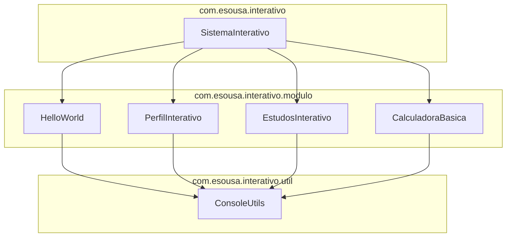

<div align="center">

# Sistema Interativo Java

[](https://github.com/ESousa97/primeiroprojetoJ/actions/workflows/ci.yml)
[](https://www.codefactor.io/repository/github/esousa97/primeiroprojetoj)
[](https://opensource.org/licenses/MIT)
[](#)

**Aplicação de console interativa para aprendizado de conceitos fundamentais de Java — menu principal com 5 módulos (Hello World, Perfil Interativo, Estudos e Anotações, Calculadora Básica, Informações do Sistema), Scanner centralizado em `ConsoleUtils`, lógica pura separada de I/O para testabilidade, build com Maven, testes parametrizados com JUnit 5, Checkstyle baseado no Google Java Style e CI em JDK 17 e 21.**

</div>

---

> **⚠️ Projeto Arquivado**
> Este projeto não recebe mais atualizações ou correções. O código permanece disponível como referência e pode ser utilizado livremente sob a licença MIT. Fique à vontade para fazer fork caso deseje continuar o desenvolvimento.

---

<div align="center">


</div>

---

## Índice

- [Sobre o Projeto](#sobre-o-projeto)
- [Funcionalidades](#funcionalidades)
- [Tecnologias](#tecnologias)
- [Arquitetura](#arquitetura)
- [Estrutura do Projeto](#estrutura-do-projeto)
- [Começando](#começando)
  - [Pré-requisitos](#pré-requisitos)
  - [Instalação](#instalação)
  - [Uso](#uso)
- [Scripts Disponíveis](#scripts-disponíveis)
- [Testes](#testes)
- [Qualidade e Governança](#qualidade-e-governança)
- [FAQ](#faq)
- [Licença](#licença)
- [Contato](#contato)

---

## Sobre o Projeto

Aplicação de console modular que demonstra conceitos básicos de Java de forma prática e interativa. O sistema apresenta um menu principal com 5 módulos funcionais, cada um encapsulado em sua própria classe com separação clara entre lógica pura e I/O.

O repositório prioriza:

- **Arquitetura modular** — Cada funcionalidade isolada em classe própria dentro de `com.esousa.interativo.modulo`, com métodos estáticos e construtores privados (classes utilitárias)
- **Scanner centralizado** — `ConsoleUtils` gerencia uma única instância de `Scanner` compartilhada entre todos os módulos, evitando conflitos de buffer e duplicação de código de validação
- **Lógica pura separada de I/O** — Métodos como `calcular()`, `gerarSaudacao()` e `gerarMensagemIdade()` não fazem I/O, tornando-os diretamente testáveis sem mocks
- **Build reprodutível** — Maven com `pom.xml` completo, Maven Wrapper incluído (`mvnw`/`mvnw.cmd`), JAR executável configurado com `maven-jar-plugin`
- **Testes parametrizados** — JUnit 5 com `@ParameterizedTest`, `@CsvSource`, `@Nested` e `@DisplayName` para testes expressivos e com boa cobertura
- **Análise estática** — Checkstyle com regras simplificadas baseadas no Google Java Style (nomenclatura, imports, braces, espaçamento, tamanho de método ≤60 linhas, tamanho de arquivo ≤500 linhas)

---

## Funcionalidades

- **Hello World Interativo** — Saudações personalizadas com 3 estilos (clássica, formal, descontraída) e opção de exibir todas simultaneamente
- **Perfil Interativo** — Coleta de nome, idade, profissão e hobby com validação de entrada e mensagem personalizada por faixa etária (<18, 18-64, 65+)
- **Estudos e Anotações** — Visualização de anotações padrão sobre Java (listas imutáveis), adição de anotações personalizadas com timestamp e dicas de estudo
- **Calculadora Básica** — Soma, subtração, multiplicação e divisão com entrada interativa ou operações pré-definidas, tratamento de divisão por zero e operação inválida
- **Informações do Sistema** — Exibição de versão Java, Java Home, sistema operacional, usuário, diretório atual e data/hora

---

## Tecnologias


**Dependências:** JDK 17+ (sem dependências de runtime externas), JUnit Jupiter 6.0.2 (test), Maven Checkstyle Plugin 3.6.0, Maven Compiler Plugin 3.15.0, Maven Surefire Plugin 3.5.4.

---

## Arquitetura



### Camadas

| Pacote | Responsabilidade |
| --- | --- |
| `com.esousa.interativo` | Entry point (`SistemaInterativo`) — banner, menu principal, loop de execução e delegação para módulos |
| `com.esousa.interativo.modulo` | Módulos funcionais com lógica de negócio e I/O de cada funcionalidade |
| `com.esousa.interativo.util` | `ConsoleUtils` — Scanner único, leitura validada (inteiro, double, idade, linha), exibição de cabeçalhos e banners |

### Decisões de Design

| Decisão | Justificativa |
| --- | --- |
| Scanner centralizado em `ConsoleUtils` | Evita múltiplas instâncias lendo `System.in` (conflitos de buffer) e elimina duplicação de validação |
| Lógica pura separada de I/O | `calcular()`, `gerarSaudacao()`, `gerarMensagemIdade()` são testáveis sem mock de `System.in`/`System.out` |
| Classes utilitárias com construtor privado | Impede instanciação — todos os métodos são estáticos, padrão Java para utility classes |
| Maven como build tool | Padrão da indústria Java, builds reprodutíveis, gerenciamento de dependências e integração com CI |

---

## Estrutura do Projeto

```
primeiroprojetoJ/
├── src/
│   ├── main/java/com/esousa/interativo/
│   │   ├── SistemaInterativo.java              # Entry point — banner + menu loop
│   │   ├── modulo/
│   │   │   ├── HelloWorld.java                 # Saudações interativas (3 estilos)
│   │   │   ├── PerfilInterativo.java           # Coleta de perfil com mensagem por idade
│   │   │   ├── EstudosInterativo.java          # Anotações e dicas (listas imutáveis)
│   │   │   └── CalculadoraBasica.java          # 4 operações com tratamento de erros
│   │   └── util/
│   │       └── ConsoleUtils.java               # Scanner único + I/O centralizado
│   └── test/java/com/esousa/interativo/modulo/
│       ├── CalculadoraBasicaTest.java           # Testes parametrizados (soma, sub, mult, div, erros)
│       ├── HelloWorldTest.java                  # Testes de saudação (3 estilos + fallback)
│       ├── EstudosInterativoTest.java           # Testes de imutabilidade das listas
│       └── PerfilInterativoTest.java            # Testes de mensagem por faixa etária
├── docs/
│   └── architecture.md                          # Diagrama e decisões arquiteturais
├── assets/
│   └── Desafios.png                             # Screenshot do menu
├── .github/
│   ├── workflows/
│   │   └── ci.yml                               # Build + Test + Checkstyle (JDK 17, 21)
│   ├── ISSUE_TEMPLATE/
│   │   ├── bug_report.md
│   │   └── feature_request.md
│   ├── PULL_REQUEST_TEMPLATE.md
│   └── dependabot.yml                           # Maven + GitHub Actions (semanal)
├── .mvn/wrapper/
│   └── maven-wrapper.properties                 # Maven 3.9.6
├── mvnw                                         # Maven Wrapper (Unix)
├── mvnw.cmd                                     # Maven Wrapper (Windows)
├── pom.xml                                      # Build config (JDK 17, JUnit 5, Checkstyle)
├── checkstyle.xml                               # Regras simplificadas (Google Java Style)
├── .editorconfig                                # UTF-8, LF, indent 4
├── .gitattributes                               # Normalização de line endings
├── CHANGELOG.md                                 # Keep a Changelog
├── CONTRIBUTING.md                              # Guia de contribuição
├── CODE_OF_CONDUCT.md                           # Contributor Covenant 2.1
├── SECURITY.md                                  # Política de segurança
└── LICENSE                                      # MIT
```

---

## Começando

### Pré-requisitos

```bash
java -version   # JDK 17 ou superior
mvn -v          # Maven 3.8+ (ou use o Maven Wrapper incluído)
```

### Instalação

```bash
git clone https://github.com/ESousa97/primeiroprojetoJ.git
cd primeiroprojetoJ
mvn clean verify
```

> O projeto inclui Maven Wrapper — se não tiver Maven instalado, substitua `mvn` por `./mvnw` (Unix) ou `mvnw.cmd` (Windows).

### Uso

**Via Maven Exec:**

```bash
mvn exec:java -Dexec.mainClass="com.esousa.interativo.SistemaInterativo" -q
```

**Via JAR:**

```bash
mvn package -DskipTests
java -jar target/sistema-interativo-1.0.0.jar
```

---

## Scripts Disponíveis

```bash
# Compilar
mvn compile

# Executar testes unitários
mvn test

# Build completo (compile + test + checkstyle)
mvn verify

# Verificar estilo de código
mvn checkstyle:check

# Gerar JAR executável
mvn package

# Gerar JAR sem testes
mvn package -DskipTests
```

---

## Testes

```bash
mvn test
```

Testes unitários com JUnit 5 cobrindo os 4 módulos:

- **CalculadoraBasicaTest** — Testes parametrizados (`@CsvSource`) para soma, subtração, multiplicação, divisão; exceções para divisão por zero e operação inválida; verificação de operadores
- **HelloWorldTest** — Saudações clássica, formal, descontraída e todas; fallback para tipo desconhecido; não-nulidade para entradas variadas
- **EstudosInterativoTest** — Verificação de não-vazio e imutabilidade (`UnsupportedOperationException`) das listas de anotações e dicas
- **PerfilInterativoTest** — Mensagens corretas por faixa etária (7 cenários parametrizados: <18, 18-64, 65+); não-nulidade

---

## Qualidade e Governança

- **CI** — GitHub Actions com matrix strategy (JDK 17 + 21): compile → test → checkstyle → package JAR (upload como artifact com retenção de 7 dias)
- **Checkstyle** — Regras simplificadas baseadas no Google Java Style: nomenclatura (TypeName, MethodName, ParameterName, LocalVariableName, MemberName, ConstantName), imports não utilizados/redundantes, braces obrigatórias, espaçamento, métodos ≤60 linhas, arquivos ≤500 linhas, sem trailing whitespace
- **Dependabot** — Atualizações semanais de Maven e GitHub Actions
- **Governança** — Issue templates (Bug Report, Feature Request), PR template com checklist, CONTRIBUTING.md, CODE_OF_CONDUCT.md, SECURITY.md
- **Zero dependências de runtime** — Apenas JDK padrão em produção; JUnit 5 e Checkstyle são exclusivamente de build/test

> Para diretrizes de contribuição, consulte [`CONTRIBUTING.md`](CONTRIBUTING.md). Para política de segurança, consulte [`SECURITY.md`](SECURITY.md).

---

## FAQ

<details>
<summary><strong>Por que Scanner centralizado em ConsoleUtils?</strong></summary>

Múltiplas instâncias de `Scanner` lendo `System.in` podem causar conflitos de buffer — ao fechar um Scanner, o `System.in` subjacente também é fechado, impedindo leituras posteriores. Um Scanner compartilhado em `ConsoleUtils` resolve isso e centraliza toda a lógica de validação de entrada (inteiros com range, doubles, idades, linhas).
</details>

<details>
<summary><strong>Como a lógica pura é separada de I/O?</strong></summary>

Métodos como `CalculadoraBasica.calcular()`, `HelloWorld.gerarSaudacao()` e `PerfilInterativo.gerarMensagemIdade()` recebem parâmetros e retornam resultados sem usar `System.in` ou `System.out`. Isso permite testá-los diretamente com JUnit sem precisar de mocks ou redirecionamento de streams.
</details>

<details>
<summary><strong>Posso usar JDK 21 ou superior?</strong></summary>

Sim. O `pom.xml` define source/target como 17 (mínimo), mas a CI testa em JDK 17 e 21. Qualquer JDK ≥17 é compatível.
</details>

<details>
<summary><strong>Por que não usar interfaces/herança para os módulos?</strong></summary>

KISS. Para 4 módulos com métodos estáticos simples, uma hierarquia de classes adicionaria complexidade sem benefício proporcional. Se o sistema crescesse para 10+ módulos, uma interface `Modulo` com registro dinâmico seria o próximo passo natural.
</details>

---

## Licença

Este projeto está sob a licença MIT. Veja o arquivo [LICENSE](LICENSE) para mais detalhes.

```
MIT License - você pode usar, copiar, modificar e distribuir este código.
```

---

## Contato

**José Enoque Costa de Sousa**

[](https://www.linkedin.com/in/enoque-sousa-bb89aa168/)
[](https://github.com/ESousa97)
[](https://enoquesousa.vercel.app)

---

<div align="center">

**[⬆ Voltar ao topo](#sistema-interativo-java)**

Feito com ❤️ por [José Enoque](https://github.com/ESousa97)

**Status do Projeto:** Archived — Sem novas atualizações

</div>
